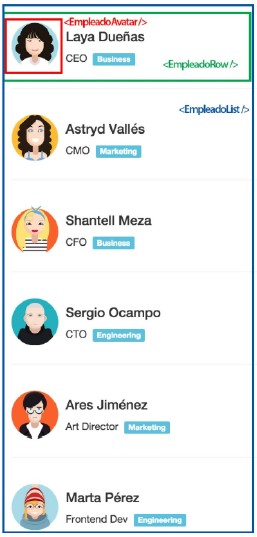

# Ejercicios React - Rolling Code School 
Prácticas con componentes, ciclo de vida del componente, eventos etc.

## Ejercicio N°7: Lista de empleados - Dificultad: 🟢🟡
Crear una aplicación web que permite reutilizar componentes siguiendo la
estructura de la siguiente imagen, pueden incorporar bootstrap u hojas de estilo
propias.



Tendremos un EmpleadoAvatar (recuadro rojo), un EmpleadoRow (recuadro verde) y
por último un EmpleadoList (recuadro azul).
Los datos de los empleados deberán ser mostrados mediante un arreglo que
deben crear similar al siguiente:
```javascript
let empleados = [
{ id: 1, fullName: "Laya Dueñas", title: "CEO", department: "Business",
pic: "empleado01.png" },
{ id: 2, fullName: "Astryd Vallés", title: "CMO", department:
"Marketing", pic: "empleado02.png" },
{ id: 3, fullName: "Shantell Meza", title: "CFO", department:
"Business", pic: "empleado03.png" },
{ id: 4, fullName: "Sergio Ocampo", title: "CTO", department:
"Engineering", pic: "empleado04.png" },
{ id: 5, fullName: "Ares Jiménez", title: "Art Director", department:
"Marketing", pic: "empleado05.png" },
{ id: 6, fullName: "Marta Pérez", title: "Frontend Dev", department:
"Engineering", pic: "empleado06.png" },
{ id: 7, fullName: "Ellen Balderas", title: "Digital Strategist",
department: "Marketing", pic: "empleado07.png" },
{ id: 8, fullName: "Cynthia Valentín", title: "Backend Dev", department:
"Engineering", pic: "empleado08.png" },
{ id: 9, fullName: "Bernard Jung", title: "DevOps Engineer", department:
"Engineering", pic: "empleado09.png" },
]
```

### Link de Deploy:
- [Netlify](https://lucasecapdevila-tpn7react76i.netlify.app/)